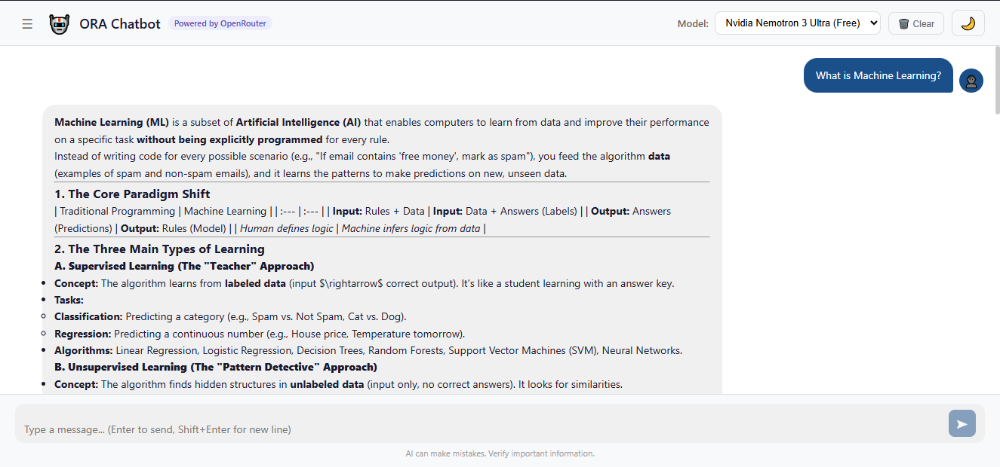
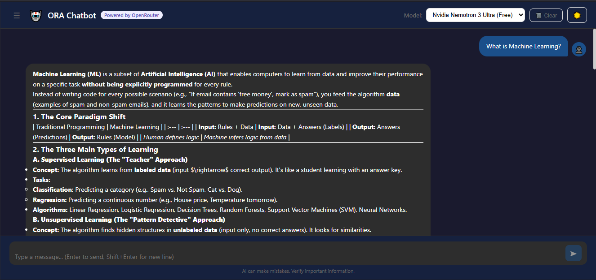
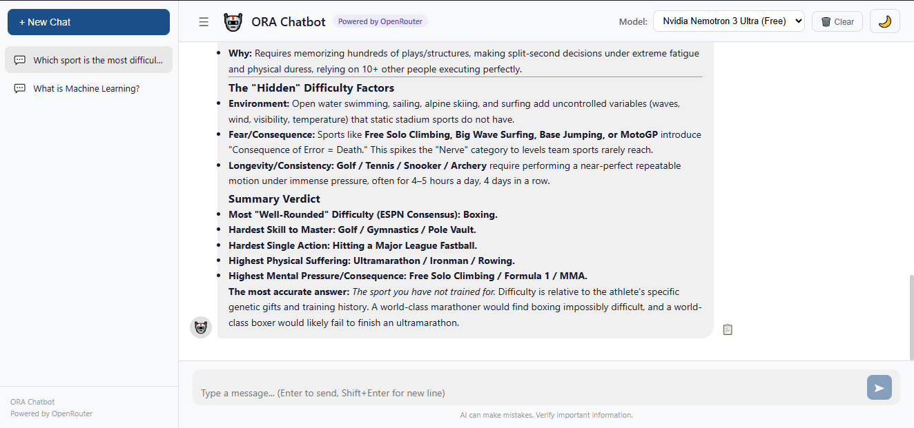
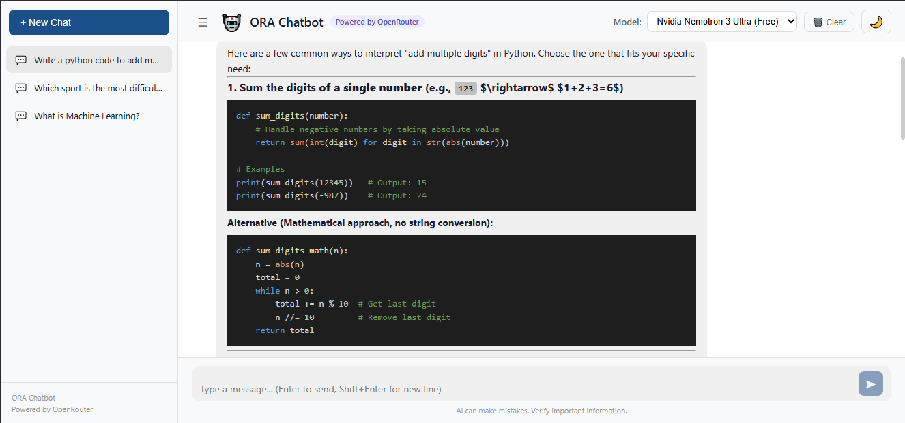

# 🤖 ORA Chatbot

**ORA (OpenRouter AI) Chatbot** is a full-stack AI chat interface that connects to multiple large language models through the OpenRouter API — including GPT-4, Claude, Nvidia, Gemini, Llama, and Mistral — all in one clean, modern UI.

---

## 🌐 Live Demo
👉 [Click here to view the live app](https://ora-chatbot-hnm59zgfc-me-0086.vercel.app)

| Service | URL |
|---------|-----|
| Frontend | https://ora-chatbot-hnm59zgfc-me-0086.vercel.app |
| Backend API | https://ora-chatbot-backend.onrender.com/api/health |
---

## ✨ Features

- 💬 **Multi-turn conversations** — full chat history with context memory
- 🔄 **Model switcher** — switch between GPT-4, Claude, Nvidia, Gemini, Llama, Mistral and more
- ⚡ **Real-time streaming** — responses appear word by word like ChatGPT
- 🗂️ **Conversation sidebar** — save and revisit past conversations
- 🌙 **Dark / Light mode** — toggle between themes
- 📋 **Copy responses** — one-click copy for any AI message
- 🎨 **Markdown rendering** — rich text, code blocks with syntax highlighting
- ⌨️ **Keyboard shortcuts** — Enter to send, Shift+Enter for new line
- ❌ **Error handling** — graceful error messages when API is unavailable

---

## 🛠️ Tech Stack

| Layer | Technology |
|-------|-----------|
| Frontend | React.js |
| Backend | Python + Flask |
| AI API | OpenRouter AI |
| Streaming | Server-Sent Events (SSE) |
| Markdown | react-markdown |
| Syntax Highlighting | react-syntax-highlighter |
| Cross-Origin | Flask-CORS |

---

## 📁 Project Structure

```
ora-chatbot/
├── backend/
│   ├── app.py              # Flask API — handles OpenRouter requests & streaming
│   ├── requirements.txt    # Python dependencies
│   └── .env                # API key (not committed)
├── frontend/
│   └── src/
│       ├── components/
│       │   ├── ChatWindow.js       # Main chat display area
│       │   ├── MessageBubble.js    # Individual message component
│       │   ├── ModelSelector.js    # Model dropdown
│       │   ├── Sidebar.js          # Conversation history sidebar
│       │   └── TypingIndicator.js  # Animated typing dots
│       ├── hooks/
│       │   └── useChat.js          # Chat state & conversation management
│       ├── utils/
│       │   └── api.js              # API calls & streaming handler
│       └── App.js                  # Root component
└── README.md
```

---

## ⚙️ Setup & Installation

### Prerequisites
- Python 3.12+
- Node.js v20+
- An [OpenRouter API key](https://openrouter.ai/keys)

### Backend Setup

```bash
cd backend
python -m venv venv
venv\Scripts\activate      # Windows
pip install -r requirements.txt
```

Create a `.env` file in the `backend` folder:
```
OPENROUTER_API_KEY=your_api_key_here
```

Run the backend:
```bash
python app.py
```
Backend runs at: `http://localhost:5000`

### Frontend Setup

```bash
cd frontend
npm install
npm start
```
Frontend runs at: `http://localhost:3000`

---

## 🔌 API Endpoints

| Method | Endpoint | Description |
|--------|----------|-------------|
| GET | `/api/health` | Health check |
| GET | `/api/models` | Returns available AI models |
| POST | `/api/chat` | Sends messages, supports streaming |

---

## 🤖 Supported Models

| Model | Provider | Type |
|-------|---------|------|
| GPT-3.5 Turbo | OpenAI | Paid |
| GPT-4o Mini | OpenAI | Paid |
| Claude 3 Haiku | Anthropic | Paid |
| Nvidia Nemotron 3 Ultra | Nvidia | Free |
| Gemini Flash 1.5 | Google | Paid |
| Gemini 2.0 Flash | Google | Free |
| DeepSeek R1 | DeepSeek | Free |
| Llama 3.1 8B | Meta | Free |
| Mistral 7B | Mistral | Free |

> **Note:** Free models may have rate limits or occasional unavailability depending on OpenRouter's current offerings.

---

## 📸 Screenshots

### 💬 Light Mode


### 🌙 Dark Mode


### 🗂️ Conversation Sidebar


### 💻 Code Syntax Highlighting


---

## 🧠 Concepts Learned

- Integrating a third-party AI API (OpenRouter) with Flask
- Real-time response streaming using Server-Sent Events (SSE)
- React custom hooks for state management
- Multi-turn conversation context management
- Markdown rendering with syntax highlighting in React
- Dark/Light mode theming with inline styles
- Environment variable management with python-dotenv
- Full stack deployment (Render + Vercel)

---

> **Note:** Backend is hosted on Render's free tier and may take ~30 seconds to wake up on first request after inactivity.